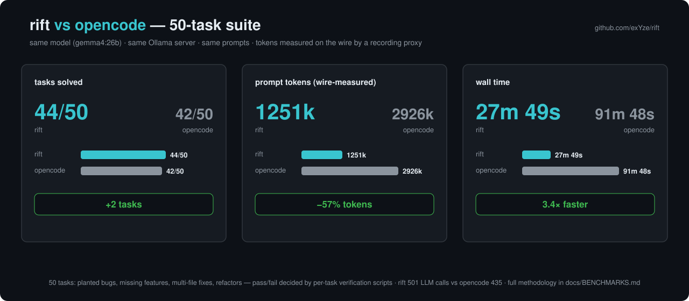
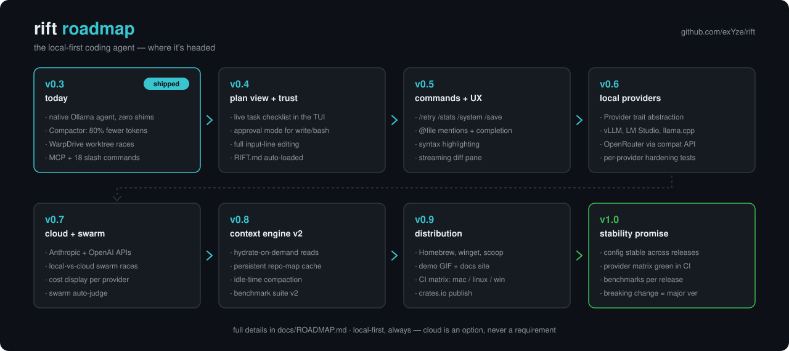
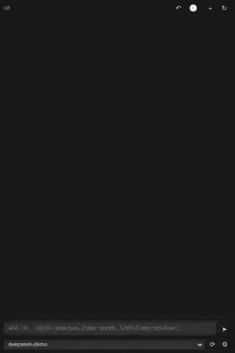

# Rift

A fast, flicker-free terminal coding agent built in Rust for **local models** — Ollama's native API and OpenAI-compatible servers (vLLM, LM Studio, llama.cpp) are first-class targets, cloud providers (Anthropic, OpenAI, OpenRouter) optional — no Node, no Python, one ~14MB binary.


**Benchmarked vs opencode** on a 50-task suite (same model, same Ollama server, wire-measured tokens): **more tasks solved (44 vs 42), 57% fewer prompt tokens, 3.4× faster** — see [docs/BENCHMARKS.md](docs/BENCHMARKS.md).

**Model matrix** (July 2026, v0.7.1): the same 50-task suite across three local models — **ornith:35b 50/50 and qwen3.6:35b 50/50** at ~520k prompt tokens each, gemma4:26b 40/50 — with per-turn traces and failure counters recorded for every run. The traces pinpointed gemma's chat-only failure mode and produced the first per-model prompt target ([details](docs/BENCHMARKS.md)).



Rift is a ground-up Rust answer to opencode/Crush-style agents, designed around the three failure modes that plague them with local models:

1. **Broken scrolling/streaming UX** → pre-wrapped line buffer with bottom-anchored scrolling; streaming never fights your scroll position.
2. **Context blowout** → explicit `num_ctx` on every request, silent-truncation detection via `prompt_eval_count`, token-capped tool outputs, AST-based context compaction (Compactor subsystem).
3. **Local tool-calling fragility** → native `/api/chat` protocol (not the OpenAI-compat shim), textual-tool-call recovery, hallucinated-tool-name aliasing, error-as-tool-result self-correction, doom-loop guard.

Plus **WarpDrive**: parallel agent exploration in isolated git worktrees with side-by-side diff merge.

## Roadmap



Full details and rationale in [docs/ROADMAP.md](docs/ROADMAP.md).

## Install

**Homebrew** (macOS / Linux):

```sh
brew tap exYze/tap && brew install rift
```

(Newer Homebrew asks once to trust third-party taps: `brew trust exyze/tap`.)

**macOS / Linux** (one line, no dependencies):

```sh
curl -fsSL https://raw.githubusercontent.com/exYze/rift/master/install.sh | sh
```

**Windows** (PowerShell — downloads, verifies the checksum, and adds to PATH):

```powershell
irm https://raw.githubusercontent.com/exYze/rift/master/install.ps1 | iex
```

**Windows via scoop** (installs straight from the manifest, auto-updates):

```powershell
scoop install https://raw.githubusercontent.com/exYze/rift/master/packaging/scoop/rift.json
```

**From source** (any platform with Rust):

```sh
cargo install --git https://github.com/exYze/rift rift-tui
```

Pre-built binaries: macOS (Apple Silicon + Intel), Linux (x64 + arm64, fully static — no glibc requirements), Windows x64. All on the [releases page](https://github.com/exYze/rift/releases) with SHA-256 checksums.

## Updating

```sh
rift update        # or /update inside the TUI
```

rift checks for new releases on startup (at most once per 24h, cached, silent when offline) and shows a one-line notice when one exists. Set `RIFT_NO_UPDATE_CHECK=1` to disable the check entirely — no other network calls are ever made except to your own Ollama server.

## VS Code extension

[`vscode/`](vscode/) packages rift for VS Code: a sidebar chat backed by
`rift --serve` — streamed thinking, boxed tool activity, a red/green diff
card for every applied edit, inline diff review, session resume and a
past-chats picker — plus the full TUI in the integrated terminal and editor
glue (launch keybindings, a status-bar button, right-click "Add
File/Selection to Prompt").



See [vscode/README.md](vscode/README.md) for install and settings.

Building your own integration (Neovim, JetBrains, anything that can spawn
a process)? `rift --serve` speaks a versioned line-JSON protocol —
[docs/SERVE.md](docs/SERVE.md) is the contract, and
`scripts/serve_client.py` is a minimal reference client.

## Plugins

A plugin is a directory with a `plugin.json`, discovered from
`.rift/plugins/` (project) and `~/.config/rift/plugins/` (user):

```json
{
  "name": "standup",
  "commands": [
    {"name": "standup", "description": "summarize recent work",
     "prompt": "Summarize the git log since yesterday. Focus: {args}"}
  ],
  "tools": [
    {"name": "ticket_lookup", "description": "Look up a ticket by id",
     "command": "python3 lookup.py",
     "parameters": {"type": "object", "properties": {"id": {"type": "string"}}}}
  ],
  "hooks": {"post_edit": ["cargo check -q"]}
}
```

Commands surface like skills (`/skill:standup focus on the parser` — also
completable in the VS Code chat); tools run a subprocess with the call's
arguments as JSON on stdin; plugins can also ship `themes/<name>.json`
color themes and (user-level only) `prompts/<family>.md` prompt targets.
Anything from a *project* plugin that executes commands — tools, hooks —
gets a one-time trust prompt at startup, keyed to the exact manifest.

## Usage

```sh
# TUI — host/model come from your config (see Config below), or pass them explicitly
rift

# ...or override per run
rift --host http://localhost:11434 --model gemma4:26b

# Headless one-shot
rift --prompt "Fix the failing test in src/lib.rs"
```

```sh
# WarpDrive: race models on a task in isolated git worktrees, then merge the winner
rift swarm "Refactor the auth middleware" --models gemma4:26b,anthropic/claude-sonnet-4-6
rift swarm "Fix the failing test" --models gemma4:26b,qwen3.6:35b --judge ornith:35b
rift merge 0-gemma4-26b --cleanup
```

Env vars: `RIFT_HOST`, `RIFT_MODEL`. Flags: `--num-ctx` (default 32768), `--max-iterations`, `-c/--continue` (resume last session), `--trace <file>` (append one JSON line per turn — tokens, tool calls, failure counters — for offline analysis; also `RIFT_TRACE`).

## Slash commands (inside the TUI)

| command | what it does |
|---|---|
| `/model [name]` | interactive model picker (↑↓/Enter), or switch directly by name |
| `/clear` | wipe the conversation |
| `/config [edit]` | show or edit `.rift.json` in `$EDITOR` (permissions hot-reload) |
| `/approve [on\|off]` | toggle approval mode without touching the config |
| `/yolo [off]` | YOLO mode: stop asking before write/edit/bash (the deny list still applies); `/yolo off` restores prompts. When prompts are on, choosing "always allow '<pattern>'" saves the pattern to your user config so that command family never asks again |
| `/copy [all\|log]` | copy the last reply, whole transcript, or activity log to the clipboard |
| `/compact` | force history compaction now |
| `/tokens` | context budget, usage estimate, estimator calibration — the status bar also shows a live `ctx 42% 13k/32k` gauge (green/amber/red as the window fills), refreshed after every turn, command, and compaction |
| `/sessions [n]` | interactive session picker, or resume the nth directly |
| `/skills` · `/skill:<name> [task]` | list packaged skills, or run one |
| `/skills new [--global] <desc>` · `/mcp new [--global] <desc>` | the agent builds its own extensions: writes a skill file, or writes + self-tests a local MCP server and registers it (trust-gated). Default is project-scoped (`.rift/`, this repo only); `--global` installs user-wide (`~/.config/rift/`, every project) — `/restart` loads them |
| `/mcp add [--global] <name> <command\|url> [args…]` | connect an existing MCP server — stdio (`/mcp add fetch uvx mcp-server-fetch`) or **remote streamable-HTTP** (`/mcp add docs https://host/mcp`) — verified, registered live (no restart), and persisted to the project `.rift.json` or user config. Remote entries take `"headers"` in the config for auth tokens |
| `/goal <condition>` | keep working until the model verifies the goal is met — turns auto-continue (up to 25) until a verified `GOAL MET`; `/goal clear` or Esc stops, bare `/goal` shows status |
| `/loop [30s\|5m\|2h] <prompt or /command>` | re-run a prompt on an interval (or back-to-back without one); `/loop stop` or Esc ends it |
| `/tasks [send <id> <text>\|eof <id>\|kill <id>]` | background tasks (shells + sub-agents): the model starts them with `bash run_in_background=true` or `agent background=true`; they keep running while you chat, the status bar shows the count, and a `[task notification]` turn reports each result back to the model. Tasks are **interactive**: `send` writes a line to a task's stdin (answer REPLs/prompts — the model does the same via its `task` tool), `eof` closes it |
| `/paste` | attach a clipboard image to your next message (vision models) — copy a screenshot, `/paste`, type your question |
| `/btw <question>` | quick side question (Claude Code-style): it sees the whole conversation but has no tools, the exchange never enters the main history, and it works even while the agent is mid-turn — ask asides (related or not) without polluting context; `/btw clear` resets the side thread |
| `/plan [clear]` | the agent's task checklist (also pinned live in the activity pane) |
| `/tools` · `/mcp` · `/permissions` | what the model can call, MCP server status, permission rules + approval state. `/permissions add\|remove <allow\|ask\|deny> <Tool(pattern)>` edits the rules live — `Bash(git push *)`, `Edit(src/**)`, `Read(~/.ssh/**)` |
| `/swarm <task> [--models a,b] [--judge m] [--explore]` | WarpDrive race without leaving the chat — models may span providers; the optional judge scores the diffs and recommends a winner |
| `/merge <name> [--cleanup]` | apply a swarm candidate's patch |
| `/undo` | revert the last turn's write/edit changes |
| `/rewind [n]` | checkpoint restore: rewind n turns (default 1) — write/edit changes AND the conversation roll back together (up to 20 turns; bash-made changes are outside the journal) |
| `/remember [fact]` | save a durable fact to project memory (`.rift/memory.md`, loaded into the system prompt every session); bare shows the memory. The model saves its own learnings with its `remember` tool |
| `/search [url\|off]` | show or set the SearXNG endpoint powering the model's `web_search` tool (probed before adoption, persisted to the user config; also `"search_url"` in JSON) |
| `/deep-research <question>` | research workflow: fan out `web_search` queries across angles, delegate source-reading to concurrent sub-agents (`fetch` + verbatim quotes), cross-check claims across sources, and synthesize a cited markdown report with a numbered source list |
| `/fork` | open a second rift window continuing a COPY of this conversation — both windows keep their own history from there |
| `/diff` | colored git diff of the working tree |
| `/init` | generate a RIFT.md project guide for agents |
| `/restart` | relaunch rift and resume this session — pick up a fresh `/update` without losing your chat |
| `/host [url]` | show or switch the model server — the type is auto-detected by probing (native Ollama, or OpenAI-compatible for vLLM/LM Studio/llama.cpp URLs like `http://host:8000/v1`); bare `/model` switches then resolve against it with the right protocol. Keyed endpoints belong in `providers` |
| `/think [on\|off\|auto\|<level>]` | thinking mode and reasoning effort. Levels `minimal`/`low`/`medium`/`high`/`xhigh`/`max` (a level implies thinking on) map to each provider's own syntax — Ollama's graded `think`, OpenAI/DeepSeek `reasoning_effort` + `thinking` toggle, Anthropic-format `output_config.effort`. Servers with fewer grades map between them (DeepSeek: low/medium→high, xhigh→max); servers that reject the params get one clean retry without them. Also `--effort <level>` / `"effort"` in config |
| `/export` | save the transcript as markdown |
| `/theme [name]` | browse (interactive picker) or switch the color theme. 13 built-in: `dark`, `light`, `mono` (terminal-native) plus 10 truecolor palettes with their own text/background/border colors — `dracula`, `nord`, `gruvbox`, `solarized-dark`, `solarized-light`, `tokyo-night`, `catppuccin`, `rose-pine`, `matrix`, `synthwave`. Persist with `"theme": "<name>"` in config |

## Config (`.rift.json` in the project, or `~/.config/rift/config.json`)

```json
{
  "host": "http://localhost:11434",
  "model": "gemma4:26b",
  "providers": {
    "openrouter": {
      "base_url": "https://openrouter.ai/api/v1",
      "api_key_env": "OPENROUTER_API_KEY"
    }
  },
  "mcp": {
    "fetch": {"command": "uvx", "args": ["mcp-server-fetch"]}
  },
  "models": {
    "smart": "vllm/deepseek-ai/DeepSeek-V4-Flash",
    "fast": "gemma4:26b"
  },
  "permissions": {
    "allow": ["Bash(git status *)", "Bash(cargo *)", "Edit(src/**)"],
    "ask": ["Bash(git push *)"],
    "deny": ["Read(~/.ssh/**)", "Bash(docker push *)"]
  }
}
```

The optional `models` map names **model roles** for multi-model workflows: the agent tool accepts `model: "<role>"` (or any full model string) per delegated task, so one session can research/spec/review on a strong model and implement on a cheap one — e.g. ask the session model to plan, then have it delegate implementation tasks with `model: "fast"` and review the reports itself. The system prompt advertises configured roles to the model automatically, `/model`'s picker lists them first, and with no `models` map everything behaves exactly as a single-model setup.

Permissions work like Claude Code's: interactive sessions **ask before `write`/`edit`/`bash` by default**, and each bash prompt offers *allow once* / *always allow `<pattern>`* (persisted to your user config — those commands never prompt again) / *allow all bash this session* / *deny*. Write/edit approval prompts show a **diff-colored preview of the pending change** and offer a persistent *always allow `Edit(<dir>/**)`* grant scoped to the file's work area. `"approve": false` in the user config or `/yolo` turns prompting off; a project `.rift.json` can only tighten (add deny/ask rules, force approval on — its allow rules are ignored).

### Granular permission rules

Three lists of `Tool(pattern)` rules with precedence **deny > ask > allow > the approval mode**:

- **`deny`** — refused outright, even in YOLO mode, even headless: `Read(~/.ssh/**)` blocks the read-side tools (read/ls/grep/glob/outline — grep and glob skip denied files *inside* their walks), `Edit(prod/**)` blocks file mutations, `Bash(git push --force *)` blocks command families, `Fetch(*://*.internal/*)` blocks URLs.
- **`ask`** — always prompts, even in YOLO mode: keep `/yolo` fast but gate the few actions that matter (`Bash(git push *)`). In a run with no interactive user, an ask rule denies.
- **`allow`** — skips the approval prompt when approval mode is on. User config only; grown automatically by the "always allow" choices on prompts.

A bare tool name (`Fetch`) matches every use. `Edit(...)` covers both the edit and write tools; `Read(...)` covers every file-reading tool; `Write(...)` scopes to just writes. Path patterns match relative and absolute paths (`*` stays in one directory, `**` crosses, `~/` expands); bash patterns are flat globs matched against every chained segment — `git status && curl evil` still prompts when only `git status` is allowed. Manage them with `/permissions add|remove <allow|ask|deny> <rule>` or in the config (hot-reloads via `/config edit`). The legacy `bash_allow`/`bash_deny` glob lists still load, folded in as `Bash(...)` rules. The built-in deny list (sudo, rm -rf /, …) is always enforced.

### Sandbox wrapper

`"permissions": {"bash_wrapper": "wsl -e sh -c '{cmd}'"}` routes **every** bash command through a containment tool — WSL, Docker (`docker run --rm -v {cwd}:/w -w /w alpine sh -c '{cmd}'`), firejail, bwrap. rift stays honest about what it is: the deny list and approval prompts are *policy*; real isolation comes from the wrapped tool, which is built for it. `{cmd}` is single-quote-escaped for `sh -c '{cmd}'` forms, `{cwd}` substitutes the project path. User config only (a cloned repo can't re-route your shell), shown in `/permissions`, applies to background tasks and sub-agents too.

### Hooks

`"hooks": {"post_edit": ["cargo check --quiet"]}` runs each command after every successful write/edit. A failing hook's output is appended to the **tool result**, so the model sees broken builds/tests immediately and fixes them in the same turn — verification stops depending on the model remembering to check. Successes just log a `hook ✓` line. Hooks in a project `.rift.json` need one-time trust at startup (they execute automatically; a cloned repo must not get that for free); user-config hooks apply as-is. Sub-agents run the same hooks.

### Agent personas

Drop `.rift/agents/<name>.md` (project) or `~/.config/rift/agents/<name>.md` (user-wide) files to define custom sub-agent types:

```markdown
---
name: reviewer
description: read-only code reviewer
model: fast
tools: read, grep, glob, outline, repo_map
---
You review code for correctness and style. You never modify anything; report findings with file:line references.
```

The `agent` tool then accepts `agent: "reviewer"` per delegated task — the persona's prompt body layers onto the base system prompt, its `tools` whitelist restricts the child's tool set, and its `model` (a role or full name) is the default when the task doesn't pick one. Configured personas are advertised to the model automatically.

Copy [`.rift.json.example`](.rift.json.example) to `.rift.json` (project — it's gitignored, so a private host stays out of git) or `~/.config/rift/config.json` (user-wide), then edit. Set `host` and `model` once and you can start the TUI with a bare `rift` — no flags needed; they're the startup defaults (a `--host`/`--model` flag or `RIFT_HOST`/`RIFT_MODEL` env var still overrides them). Other optional keys mirror the flags: `num_ctx`, `temperature`, `max_iterations`. For metered providers, `/stats` shows an estimated cost — Anthropic model rates are built in; add a `"pricing"` map (`{"gpt-5": {"input": 1.25, "output": 10.0}}`, $ per million tokens, matched by model-name substring) for anything else. Set `"approve": true` (or launch with `--approve`) to pause for a y/n picker before every write/edit/shell action, with per-session "always allow". Project context files (`RIFT.md`, `AGENTS.md`, `CLAUDE.md`) at the repo root are loaded into the system prompt automatically (`/init` writes a RIFT.md for you). On multi-step tasks the agent maintains a visible task checklist, pinned at the top of the activity pane.

### Model providers

By default `model` names an Ollama model on `host`. To reach an **OpenAI-compatible** endpoint (OpenRouter, vLLM, LM Studio, llama.cpp, LiteLLM, or Ollama's own `/v1`), declare it under `providers` and address a model as `provider/model` — the part before the first `/` selects the provider, the rest is sent as the model name:

```
rift --model openrouter/qwen/qwen3-30b-a3b       # one-off
```
```json
{ "model": "openrouter/qwen/qwen3-30b-a3b", "providers": { "openrouter": { "base_url": "https://openrouter.ai/api/v1", "api_key_env": "OPENROUTER_API_KEY" } } }
```

Each provider takes a `base_url` (a `/v1` suffix is added if you omit it) and, if the endpoint needs auth, either `api_key_env` (name of an environment variable to read — keeps the secret out of the file) or a literal `api_key`. `/model provider/model` switches providers live within a session; a bare model name always routes to the Ollama `host`.

## Skills

Package reusable instructions as [Agent Skills](https://agentskills.io)-style `SKILL.md` files:

```
.rift/skills/<name>/SKILL.md        # project (commit them)
~/.config/rift/skills/<name>.md     # user-wide
```

```markdown
---
name: release-check
description: checklist to verify the project is ready for release
---
1. Run the test suite ...
```

Skills are listed to the model by name + description only (progressive disclosure — bodies stay out of context); the model loads one with its `skill` tool when relevant, or you invoke one directly with `/skill:<name> [task]` (they autocomplete in the `/` palette). `/skills` lists what's available.

MCP server tools are exposed to the model as `<server>_<tool>`. A built-in deny list (sudo, `rm -rf /`, mkfs, …) always applies to shell commands.

## Attachments

Mention a file with `@path` in any prompt (Tab completes against the project file index). Text/code files attach as a token-stingy outline — the model sees the structure and can `read` exact ranges itself. **Images** (`@screenshot.png`, jpg/gif/webp/bmp, up to 10 MB) attach as base64 for vision-capable models: paste a UI screenshot and ask what's wrong, attach a diagram and ask the model to implement it. `/paste` grabs an image straight off the clipboard (PowerShell on Windows, `pngpaste` on macOS, `wl-paste`/`xclip` on Linux) and stages it for your next message. Ollama reports vision capability per model (`gemma4`, llava, …); OpenAI-compatible servers reject images on text-only models with a clear error. Headless runs attach with `--attach <path>` (repeatable; text files append their content, images ride as base64).

### Scripting (headless JSON output)

`rift -p "..." --output-format json` reserves stdout for a single machine-readable result object — `{"model", "reply", "tools": [{name, ok}…], "stats": {iterations, tokens, duration…}, "estimated_cost_usd", "session"}` — while progress streams to stderr. Pipe it to `jq`, parse it in CI, or chain rift runs in scripts.

## Elicitation

In interactive sessions the model gets an `ask_user` tool: when a task is ambiguous it pauses and asks you a clarifying question instead of guessing — multiple-choice questions open the same ↑↓/Enter picker, free-text questions turn the input box into an answer field (Esc skips, and the model proceeds on its own judgment). Headless and swarm runs stay fully autonomous.

## Sub-agents & background tasks

The model can delegate with its `agent` tool: 1–4 self-contained tasks run as **concurrent sub-agents**, each with its own context window and full tool set (results come back as the tool result; nesting is blocked, and `/model`/`/host` switches carry over). Long commands don't block the conversation either: `bash run_in_background=true` (and `agent background=true`) start **background tasks** that keep running while you keep chatting — the status bar shows the live count, `/tasks` lists them (`/tasks kill <id>` stops one), the model polls them with its `task` tool, and when one finishes on its own a `[task notification]` turn hands the result back to the model so it can react. Background tasks end with the rift process — nothing is orphaned.

## Workspace layout

- `crates/rift-provider` — the `Provider` trait plus the neutral wire types (messages, tool calls, stream deltas) every backend maps to.
- `crates/rift-ollama` — native Ollama client: NDJSON streaming, tool calls, thinking, capability detection, truncation detection.
- `crates/rift-openai` — OpenAI-compatible client: SSE streaming, tool-call correlation by id, string-encoded arguments (vLLM, LM Studio, llama.cpp, OpenRouter, LiteLLM, Ollama `/v1`).
- `crates/rift-core` — agent engine: tool registry (read/write/edit/bash/ls/grep/glob/task/agent), agent loop, sub-agents, background tasks, local-model hardening.
- `crates/rift-tui` — `rift` binary: ratatui frontend + headless mode.

See `docs/PROJECT.md` for status and roadmap, `docs/RESEARCH.md` for the protocol/architecture research this is built on.
